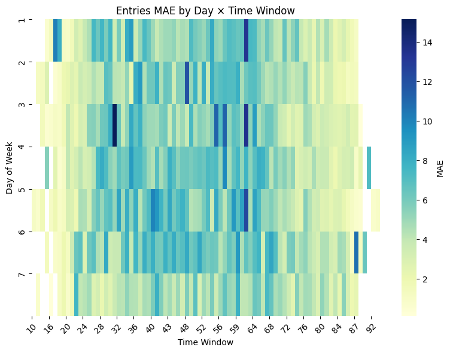

# Mobility Model Card for Zone-entries-exits-prediction
  
Jump to section:

- [Model details](#model-details)
- [Intended use](#intended-use)
- [Factors](#factors)
- [Metrics](#metrics)
- [Evaluation data](#evaluation-data)
- [Training data](#training-data)
- [Quantitative analyses](#quantitative-analyses)
- [Ethical considerations](#ethical-considerations)
- [Caveats and recommendations](#caveats-and-recommendations)

## Model details

### Person or organization developing model

INLECOM INNOVATIONS (SME)

### Model date

FIRST SEMESTER OF 2025 

### Model version

This model is the first version, corresponding to the prototype. 

### Unique identifier. 

Prototype version: B_NN_v1 

### Model type

A Neural Network (feed-forward, fully connected, Keras Sequential) with embedding for categorical zones and dense layers for prediction of entries and exits of passengers per zone per timewindow.

### Geographic area covered

The dataset is trained on data describing public transport demand (number of entries and exits) in Riga (Latvia) and refers to zones of this city.

###  Information about training algorithms, parameters, fairness constraints or other applied  approaches, and features

The algorithm is a supervised regression with NN, comprising 1 embedding layer mapping from 133 to 48 dimensions, 2 dense layers with relu activation (128-64 nodes respectively) each accompanied by a batch normalisation layer and a 15% dropout layer, 2 dense layers with relu activation (32-16 nodes respectively), and 1 dense layer with 2 nodes and linear activation. The total parameters of the model are 24.578 of which trainable are the 24.194. The model is trained for 200 epochs with batch size 128. The training uses an Adam optimiser with learning rate 0.005 that is reduced after 5 epochs without loss improvement, mean square logarithmic loss, and mean absolute error.  

The features are datetime_day_week (day of the week i.e. 1,2,..7), datetime_W (15-minute timewindow within the day), and zone_codes.

The target values are m_entries (number of entries) and m_exits (number of exits).

### Paper or other resource for more information

[EMERALDS Github Repository](https://github.com/emeralds-horizon)

[EMERALDS Website](https://emeralds-horizon.eu/)

### Citation details

Stathis Antoniou, "Zone entries/exits prediction",  GitHub repository, 2025, Available: https://github.com/emeralds-horizon/zone-entries-exits-prediction

### License

GPL-3.0 license, see [link](https://github.com/emeralds-horizon/Zone-entries-exits-prediction?tab=GPL-3.0-1-ov-file)

### Contact details 

stathis.antoniou@inlecomsystems.com

asimina.mertzani@inlecomsystems.com

## Intended use

### Primary intended uses

The model is designed to predict passenger demand (entries and exits) per day, time window, and zone in one of the mobility pilots of the EU Horizon EMERALDS project.
Its purpose is to test how AI-based methods (neural networks) can contribute to mobility forecasting and decision support within the project’s objectives.

### Prediction horizon

Predictions are made at the day and time window level (weekly temporal granularity), so the horizon is short-term passenger demand forecasting (hours to days ahead).

### Example results

Example:
Input: Day = 2, Time = 15:54, Zone = Rumbula
Output: Predicted entries = 11.1, exits = 10.5

### Primary intended users

Primary intended users are the consortium partners of EMERALDS (for pilot testing). Also, this model could be used by researchers in mobility/transportation (evaluating AI contribution to forecasting), and urban planners and transport authorities (in the longer term, for decision support in passenger flow management).

### Transferability

The model is pilot-specific but with some modifications it can be tranferable. Specifically, the transferability of the model was tested in open-source data, where the model was slightly modified to provide predictions of passengers in public transportation, as described here: https://github.com/emeralds-horizon/Zone-entries-exits-prediction/blob/main/D_NN%20Transferability.ipynb.

### Out-of-scope use cases

The model is not trained specifically on extreme events (road closures, strikes, weather disruptions, emergencies), is not intended to be used for real-time control, or for long-term planning (>12 months), therefore it is not recommended to be used in such ways. 

## Factors

### Mobility context

The model is designed for urban mobility demand prediction. Therefore, it applies best to vehicle-based urban transport (rather than walking/cycling or intercity travel) and to users without special needs.

### Environmental conditions

The dataset does not include information regarding the weather or special event, so the model assumes normal conditions. Performance may degrade under extreme weather, accidents, or unusual traffic disruptions.

### Evaluation factors

Model's performance is evaluated globally across all samples, without stratifying by road type, time of day, or user group. Metrics used (MAE, R²) are overall averages, not conditional on factors.

## Metrics

### Model performance measures

The model is evaluated using MAE (Mean Absolute Error) and R² (Coefficient of Determination). These are standard for regression-based mobility models.

### Decision thresholds

The model provides predictions at a continuous scale (entries and exits). Probability cutoffs and thresholds in terms of forecast horizon or spatial/temporal resolution have not been explicitly defined and used for the model's evaluation. However, temporal resolution can be changed by defining a different time-window than the current 15min. Similarly, one can change the spatial resolution. Both changes might require fine-tuning the model hypermeters. For an example on how the model is changed for different spaciotemporal resolutions, see here: https://github.com/emeralds-horizon/Zone-entries-exits-prediction/blob/main/D_NN%20Transferability.ipynb.

### Approaches to uncertainty and variability: 

The current prototype does not explicitly quantify uncertainty. Model variability was only assessed through a single train/test split, with evaluation based on regression metrics (MSE, R²). No repeated runs, confidence intervals, or uncertainty estimates were included. Therefore, variability in results may arise from random train/test splits or neural network initialisation, but this was not systematically measured.

## Training data

### Datasets

The training data is derived from trip chaining results (result04_2024_v9.csv, result05_2024_v9.csv, result06_2024_v9.csv, result07_2024_v9.csv) enriched with zone mapping information (plānošanas zonas.csv). Specifically, the data in result04_2024_v9.csv, result05_2024_v9.csv, result06_2024_v9.csv, result07_2024_v9.csv describe passenger trips (entry and exit stops) in public transportation per datetime, during April–July 2024 in Riga, Latvia. The data in plānošanas zonas.csv provide a mapping from stops and stop_ids to zones.

The initial datast is preprocessed to take the form "entry zone, day of the week, datetime window, entries, exits", saved as A_df.csv and used for model training. Therefore, the model can be trained on anything that takes the form "day of the week, timewindow, a categorical variable (such as zone), number of entries, and number of exits", while it can predict public transport demand (entries and exits) per zone, per day of the week, per timewindow, without requiring from the end-user to provide all the info of the passenger trips. 

### Motivation

These datasets were chosen because they represent the most complete available pilot mobility data within EMERALDS, capturing passenger flows (entries and exits) at the granularity needed for forecasting. 

### Preprocessing

The preprocessing pipeline was carried out independently of the model and included:

- Data integration: merging multiple months of trip-chain CSVs.
- Stop/zone harmonisation: removing leading zeros from stop IDs, handling missing IDs, joining with zone definitions.
- Datetime processing: converting timestamps, extracting day of week, and creating time window bins.
- Aggregation: summing entries and exits per zone, time window, day.
- Feature engineering: producing datetime_day_week, datetime_W, and zone_codes.
- Scaling: numerical features scaled with MinMaxScaler.
- Model-ready dataset: final input to NN requires only zone code, day of week, and time window, which are sufficient to predict entries and exits.

## Evaluation data

### Datasets

The evaluation dataset is a held-out subset of the preprocessed dataset (A_df.csv), which itself originates from trip-chain results (April–July 2024). Evaluation is performed on zones and time windows not used in training, selected via train_test_split, and consequently has same spatial and temporal coverage as training. 

### Motivation

The evaluation data was chosen to provide a realistic benchmark of predictive performance under the same conditions as training. The simple split enables testing whether the NN model can generalise to unseen passenger flows.

### Preprocessing

Evaluation data underwent the same preprocessing pipeline as the training data (since the train_test_split step was applied after preprocessing the data). Specifically, the preprocessing pipeline can be executed independently of the model, ensuring consistency between training and evaluation inputs.

## Quantitative analyses

### Unitary results

The model was evaluated separately by **day of week**, **time window**, and **zone**.  
For each factor, Mean Absolute Error (MAE) was calculated for both **entries** and **exits**.  
This shows how prediction performance varies depending on temporal and spatial dimensions.

- **Day of Week:** Some days exhibited systematically higher or lower MAE (e.g., weekends vs weekdays). For example, Saturday has systematically higher MAE while Sunday has lower.  

  

- **Time Window:** Performance varied by time of day, with peak hours typically harder to predict.  

  

- **Zone:** Prediction errors were not evenly distributed across zones; some zones consistently showed higher MAE. For instance, the zone with code 22 (i.e. Centrs-Tirgus) has significantly higher MAE.

  

### Intersectional result

We further analysed pairwise combinations of factors:

- **Zone × Day of Week**

<table>
  <tr>
    <td></td>
    <td></td>
  </tr>
  <tr>
    <td align="center">Figure 1: Zone-Day Entries Heatmap</td>
    <td align="center">Figure 2: Zone-Day Exits Heatmap</td>
  </tr>
</table>

- **Zone × Time Window**  

<table>
  <tr>
    <td></td>
    <td></td>
  </tr>
  <tr>
    <td align="center">Figure 1: Zone-Time Entries Heatmap</td>
    <td align="center">Figure 2: Zone-Time Exits Heatmap</td>
  </tr>
</table>

- **Day of Week × Time Window**

<table>
  <tr>
    <td></td>
    <td></td>
  </tr>
  <tr>
    <td align="center">Figure 1: Day-Time Entries Heatmap</td>
    <td align="center">Figure 2: Day-Time Exits Heatmap</td>
  </tr>
</table>

Heatmaps were generated to visualise how MAE changes across intersections of spatial and temporal factors.  
For example, in the **Zone × Day heatmap**, certain zones on weekdays showed systematically higher prediction errors (e.g. 22 - Centrs-Tirgus and 24 - Centrs-parks).

### Multidimensionality 

The model outputs **entries** and **exits** simultaneously.  
To compare performance across different factors, we report the **average Mean Absolute Error (MAE)** for each dimension:

| Dimension        | Avg Entry MAE | Avg Exit MAE |
|------------------|---------------|--------------|
| Day of Week      | **5.30**      | **4.73**     |
| Time Window      | **4.70**      | **4.21**     |
| Zone             | **4.80**      | **4.30**     |

These results suggest that prediction errors vary slightly across dimensions, with **day-of-week effects** being the hardest to capture on average.

### Analysis units

- **Granularity**: zone × time window × day  
- **Reported**: per zone, per day, per time window, and aggregated summaries  
- **Visuals**: lineplots and heatmaps illustrate how errors vary across combine dimensions

## Ethical considerations

### Environmental impact

The model is a relatively small feedforward neural network trained on a single dataset. Training and inference require modest computational resources (standard CPU or GPU) that can run locally on a basic laptop. Compared to large-scale deep learning models, the carbon footprint and energy use are minimal. 

### Societal impact

The model could be used for urban mobility analysis or traffic prediction, supporting planners and policymakers. Such use would benefit the community living in urban zones, by improving the user experience and decreasing the duration of communiting. However, the model may also misrepresent underserved areas if training data is biased (e.g., fewer samples from low-income neighborhoods) - which is not something that was observed in the data. In such scenario, if used operationally, this could reinforce inequities in infrastructure or resource allocation. Furthermore, the data was automatically stored and no workers were required for preprocessing/labelling the data.

### Biases

The training dataset represents a single city/region. Predictions are therefore biased toward local mobility patterns and may not generalize to other geographies or transport systems. Temporal biases (training data limited to a given time range) may also reduce validity in the future. However, no explicit bias mitigation was applied.

### Explainability

The model is a neural network, which is not inherently interpretable. The notebook does not apply any explainability tools (e.g., SHAP, LIME). As a result, the model is effectively a "black box", and users cannot directly see which features influence predictions.

## Caveats and recommendations

### Recent legal / environmental changes

The model relies on historical data only and does not account for recent or future policy changes (e.g., new traffic restrictions, speed limits, infrastructure updates, or transit expansions). Predictions may become less accurate over time as the real-world system evolves.

### Technical dependencies

The notebook depends on standard Python ML stack: TensorFlow/Keras, NumPy, Pandas, Matplotlib. These must be installed in the environment for successful training and inference, however they are not provided in a requirements file. -> The notebooks depend on standard Python ML libraries such as TensorFlow/Keras, NumPy, Pandas and Matplotlib. These must be installed in the environment for successful training and inference. They are not provided in a requirement file, but each notebook contains the required imports in their first cell.

### Retraining

Performance may degrade due to data drift (e.g., seasonal changes, post-pandemic mobility shifts). Retraining is recommended periodically (e.g., quarterly or yearly), especially after significant changes in urban mobility patterns.

### Related model cards

Related spatiotemportal prediction models are:
-https://github.com/emeralds-horizon/analytics-and-learning/tree/main/uc1-crowd-model
-https://github.com/emeralds-horizon/analytics-and-learning/tree/main/uc1-parking-model
