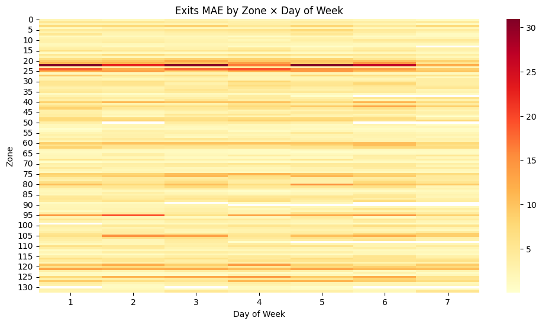
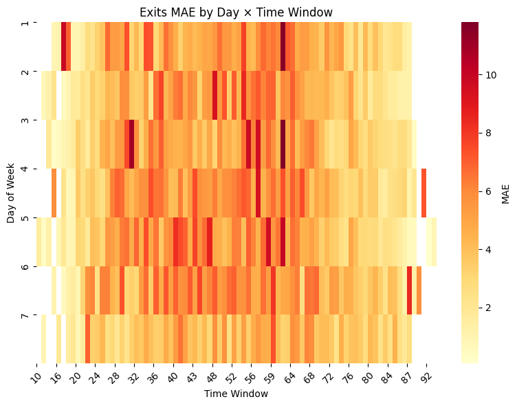

# Mobility Model Card for Zone-entries-exits-prediction

*For explanations of the sections and example model cards, please revisit the orginal [Google paper](https://arxiv.org/abs/1810.03993) and our [Mobility Model Card manuscript](EMERALDS_Mobility_Model_Cards_submitted.pdf)*
  
Jump to section:

- [Model details](#model-details)
- [Intended use](#intended-use)
- [Factors](#factors)
- [Metrics](#metrics)
- [Evaluation data](#evaluation-data)
- [Training data](#training-data)
- [Quantitative analyses](#quantitative-analyses)
- [Ethical considerations](#ethical-considerations)
- [Caveats and recommendations](#caveats-and-recommendations)

## Model details

### Person or organization developing model

*What person or organization developed the model? This can be used by all stakeholders to infer details pertaining to model development and potential conflicts of interest.*

INLECOM INNOVATIONS (SME)

### Model date

*When was the model developed? This is useful for all stakeholders to become further informed on what techniques and data sources were likely to be available during model development*

FIRST SEMESTER OF 2025

### Model version

*Which version of the model is it, and how does it differ from previous versions? This is useful for all stakeholders to track whether the model is the latest version, associate known bugs to the correct model versions, and aid in model comparisons.*

### Unique identifier. 

Prototype version: B_NN_v1

*In addition to the model version, a unique identifier should be assigned to facilitate tracking and linking between related models. This could be implemented using universally unique identifiers (UUIDs) or other standardized referencing systems. (See also the “Related model cards” addition to the Caveats and Recommendations section.)*

### Model type

*What type of model is it? This includes basic model architecture details, such as whether it is a Naive Bayes classifier, a Convolutional Neural Network, etc. This is likely to be particularly relevant for software and model developers, as well as individuals knowledgeable about machine learning, to highlight what kinds of assumptions are encoded in the system.*

A Neural Network (feed-forward, fully connected, Keras Sequential) with embedding for categorical zones and dense layers for prediction of entries and exits of passengers per zone per timewindow.

### Geographic area covered

*Mobility models are often location specific. A model trained in one city may not be directly transferable to another. Therefore, specifying the geographic coverage—whether as named regions, a bounding box, or a map plot—is crucial for identifying suitable models. Additionally, if the model has been trained to provide predictions for a certain time only, its valid time extent should also be clearly stated*

The dataset is trained on data describing public transport demand (number of entries and exits) in Riga (Latvia) and refers to zones of this city.

###  Information about training algorithms, parameters, fairness constraints or other applied  approaches, and features

The algorithm is a Supervised regression with NN, comprising 1 embedding layer mapping from 133 to 48 dimensions, 2 dense layers with relu activation (128-64 nodes respectively) each accompanied by a batch normalisation layer and a 15% dropout layer, 2 dense layers with relu activation (32-16 nodes respectively), and 1 dense layer with 2 nodes and linear activation. The total parameters of the model are 24.578 of which trainable are the 24.194. The model is trained for 200 epochs with batch size 128. The training uses an Adam optimiser with learning rate 0.005 that is reduced after 5 epochs without loss improvement, mean square logarithmic loss, and mean absolute error.  

The features are datetime_day_week (day of the week i.e. 1,2,..7), datetime_W (15-minute timewindow within the day), and zone_codes.

The target values are m_entries (number of entries) and m_exits (number of exits).

### Paper or other resource for more information

*Where can resources for more information be found?*

[EMERALDS Website](https://emeralds-horizon.eu/)

[EMERALDS Github Repository](https://github.com/emeralds-horizon)

### Citation details

*How should the model be cited?*
????

### License

*License information can be provided.*
Open for use.

### Contact details 

*Where to send questions or comments about the model.*
???

## Intended use

### Primary intended uses

*Mobility models serve diverse use cases, including trajectory prediction and imputation, travel or arrival time estimation, (sub)trajectory classification, anomaly detection, next-location and destination prediction, synthetic data generation, location classification, and traffic volume or crowd flow prediction. Clearly specifying the model’s intended application helps ensure appropriate usage.*

The model is designed to predict passenger demand (entries and exits) per day, time window, and zone in one of the mobility pilots of the EU Horizon EMERALDS project.
Its purpose is to test how AI-based methods (neural networks) can contribute to mobility forecasting and decision support within the project’s objectives.

### Prediction horizon

*Since many mobility models involve forecasting, it is essential to indicate the model’s prediction horizon, i.e., how far into the future predictions can be generated, if applicable. This helps users assess the model’s suitability for specific planning or real-time applications.*

Predictions are made at the day and time window level (weekly temporal granularity), so the horizon is short-term passenger demand forecasting (hours to days ahead).

### Example results

*Providing sample outputs, such as predictions or classifications, can illustrate the model’s behavior and expected performance in practical scenarios.*
Example:
Input: Day = 2, Time = 15:54, Zone = Rumbula
Output: Predicted entries = 11.1, exits = 10.5

### Primary intended users

*Some mobility models are robust enough for real-time traffic control, while others are designed for urban planning, transport policy analysis, or research. Identifying the primary audience helps align expectations regarding model capabilities. This may also include whether the model expects data in a streaming format or batch processing.*
 
Primary intended users are the consortium partners of EMERALDS (for pilot testing). Also, this model could be used by researchers in mobility/transportation (evaluating AI contribution to forecasting), and urban planners and transport authorities (in the longer term, for decision support in passenger flow management).

### Transferability

*Mobility models often depend on specific geographic regions, transport networks, or modes of transport. For example, a travel time prediction model trained on taxi data may not generalize well to private vehicles, as taxis often have access to dedicated lanes. It is important to specify whether the model can be applied to other regions, network sections, or transport modes without retraining. If retraining is required, this should be explicitly noted.*

The model is pilot-specific but with some modifications it can be tranferable. Specifically, the transferability of the model was tested in open-source data, where the model was slightly modified to provide predictions of passengers in public transportation, as described here: https://github.com/emeralds-horizon/Zone-entries-exits-prediction/blob/main/D_NN%20Transferability.ipynb.

### Out-of-scope use cases

*Certain mobility scenarios, such as extreme events (e.g., road closures, accidents, or natural disasters), may be underrepresented or entirely missing from the training data. The Model Card should specify these limitations to avoid misleading interpretations of model outputs.*

The model is not trained specfically on extreme events (road closures, strikes, weather disruptions, emergencies), is not intended to be used for real-time control, or for long-term planning (>12 months), therefore it is not recommended to be used in such ways. 

## Factors

### Mobility context

*Mobility models may perform differently depending on their application context. Factors such as road type (e.g., highways vs. urban streets), mode of transport (e.g., motorized vehicles vs. walking or cycling), user groups (e.g., wheelchair users, individuals without private vehicles), or geographic setting (e.g., urban vs. rural areas) should be explicitly documented.*

The model is designed for urban mobility demand prediction. Thereforfe, it applies best to vehicle-based urban transport (rather than walking/cycling or intercity travel) and to users without special needs.

### Environmental conditions

*Model performance can vary significantly based on environmental factors. For example, a model may perform well under normal weather conditions but worse during bad or extreme weather events. Clearly stating the environmental conditions under which the model can provide reliable results can help users anticipate potential limitations.*

The dataset does not include information regarding the weather or special event, so the model assumes normal conditions. Performance may degrade under extreme weather, accidents, or unusual traffic disruptions.

### Evaluation factors

*Which factors are being reported, and why were these chosen? If the relevant factors and evaluation factors are different, why?*

Model's performance is evaluated globally across all samples, without stratifying by road type, time of day, or user group. Metrics used (MAE, R²) are overall averages, not conditional on factors.

## Metrics

### Model performance measures

*The choice of evaluation metrics depends on the specific mobility use case. Commonly used metrics include Mean Absolute Percentage Error (MAPE), Coefficient of Determination (R2), Root Mean Squared Error (RMSE), and Precision and Recall for classification-based mobility tasks. A structured overview of relevant metrics is provided in [7].*

The model is evaluated using MAE (Mean Absolute Error) and R² (Coefficient of Determination). These are standard for regression-based mobility models.

### Decision thresholds

*To contextualize performance measurements, it is important to specify the thresholds used in the evaluation. These may include the forecast horizon (e.g., 15-minute or 1-hour predictions), spatial resolution (e.g., traffic density per road segment), and temporal resolution (e.g., hourly or daily mobility forecasts).*

The model provides predictions at a continuous scale (entries and exits). Probability cutoffs and thresholds in terms of forecast horizon or spatial/temporal resolution have not been explicitly defined and used for the model's evaluation.  (?)

### Approaches to uncertainty and variability: 

*How are the measurements and estimations of these metrics calculated? For example, this may include standard deviation, variance, confidence intervals, or KL divergence. Details of how these values are approximated should also be included (e.g., average of 5 runs, 10-fold cross-validation).*

The current prototype does not explicitly quantify uncertainty. Model variability was only assessed through a single train/test split, with evaluation based on regression metrics (MSE, R²). No repeated runs, confidence intervals, or uncertainty estimates were included. Therefore, variability in results may arise from random train/test splits or neural network initialisation, but this was not systematically measured.

## Training data

### Datasets

*Clearly describing the spatial and temporal coverage of the training and evaluation data is crucial. This includes details such as the geographic extent, time span, and sampling interval of mobility time series. If publicly available datasets were used, persistent identifiers (e.g., Zenodo IDs) should be provided for reproducibility.*

The training data is derived from trip chaining results (result04_2024_v9.csv, result05_2024_v9.csv, result06_2024_v9.csv, result07_2024_v9.csv) enriched with zone mapping information (plānošanas zonas.csv). Specifically, the data in result04_2024_v9.csv, result05_2024_v9.csv, result06_2024_v9.csv, result07_2024_v9.csv describe passenger trips (entry and exit stops) in public transportation per datetime, during April–July 2024 in Riga, Latvia. The data in plānošanas zonas.csv provide a mapping from stops and stop_ids to zones.

The initial datast is preprocessed to take the form "entry zone, day of the week, datetime window, entries, exits", saved as A_df.csv and used for model training. Therefore, the model can be trained on anything that takes the form "day of the week, timewindow, a categorical variable (such as zone), number of entries, and number of exits", while it can predict public transport demand (entries and exits) per zone, per day of the week, per timewindow, without requiring from the end-user to provide all the info of the passenger trips. 

### Motivation

*Why were these datasets chosen?*

These datasets were chosen because they represent the most complete available pilot mobility data within EMERALDS, capturing passenger flows (entries and exits) at the granularity needed for forecasting. (Q: say somwthing more specific about our task ?)

### Preprocessing

*Mobility data often contains quality issues such as missing values, outliers, or inconsistencies that must be addressed before training. The Model Card should describe preprocessing steps, including data cleaning methods, resampling strategies,
discretization, and aggregation processes. Transparency in these procedures ensures a better understanding of model reliability and potential limitations.*

The preprocessing pipeline was carried out independently of the model and included:

- Data integration: merging multiple months of trip-chain CSVs.
- Stop/zone harmonisation: removing leading zeros from stop IDs, handling missing IDs, joining with zone definitions.
- Datetime processing: converting timestamps, extracting day of week, and creating time window bins.
- Aggregation: summing entries and exits per zone, time window, day.
- Feature engineering: producing datetime_day_week, datetime_W, and zone_codes.
- Scaling: numerical features scaled with MinMaxScaler.
- Model-ready dataset: final input to NN requires only zone code, day of week, and time window, which are sufficient to predict entries and exits.

## Evaluation data

### Datasets

*Clearly specifying the spatial and temporal coverage of evaluation data helps users understand the conditions under which the model was tested. Information should include the geographic areas ane time spans.*

The evaluation dataset is a held-out subset of the preprocessed dataset (A_df.csv), which itself originates from trip-chain results (April–July 2024). Evaluation is performed on zones and time windows not used in training, selected via train_test_split, and consequently has same spatial and temporal coverage as training. 

### Motivation

*Why were these datasets chosen?*

The evaluation data was chosen to provide a realistic benchmark of predictive performance under the same conditions as training. The simple split enables testing whether the NN model can generalise to unseen passenger flows.

### Preprocessing

*Proper handling of spatial and temporal correlations in the evaluation dataset is crucial. The Model Card should describe the methodology used to split training and evaluation data, ensuring that no data leakage occurs. In mobility predictions, time series-based splits are often required to accurately reflect real-world deployment conditions.*

Evaluation data underwent the same preprocessing pipeline as the training data (since the train_test_split step was applied after preprocessing the data). Specifically, the preprocessing pipeline can be executed independently of the model, ensuring consistency between training and evaluation inputs.

## Quantitative analyses

### Unitary results

*How did the model perform with respect to each factor?*

The model was evaluated separately by **day of week**, **time window**, and **zone**.  
For each factor, Mean Absolute Error (MAE) was calculated for both **entries** and **exits**.  
This shows how prediction performance varies depending on temporal and spatial dimensions.

- **Day of Week:** Some days exhibited systematically higher or lower MAE (e.g., weekends vs weekdays). For example, Saturday has systematically higher MAE while Sunday has lower.  

- **Time Window:** Performance varied by time of day, with peak hours typically harder to predict.  

- **Zone:** Prediction errors were not evenly distributed across zones; some zones consistently showed higher MAE. For instance, the zone with code 22 has significantly higher MAE.

### Intersectional result

*How did the model perform with respect to the intersection of evaluated factors?*

We further analysed pairwise combinations of factors:

- **Zone × Day of Week** 

  
  

- **Zone × Time Window**  

  
 

- **Day of Week × Time Window**

  
  

Heatmaps were generated to visualise how MAE changes across intersections of spatial and temporal factors.  
For example, in the **Zone × Day heatmap**, certain zones on weekdays showed systematically higher prediction errors (e.g. 22 and 24).

### Multidimensionality 

*Mobility models often generate outputs across multiple dimensions, such as demographic, geographic, and temporal factors. Evaluating model performance separately for each of these dimensions helps identify biases and assess whether the model generalizes well across different user groups and environments.*

The model outputs **entries** and **exits** simultaneously.  
To compare performance across different factors, we report the **average Mean Absolute Error (MAE)** for each dimension:

| Dimension        | Avg Entry MAE | Avg Exit MAE |
|------------------|---------------|--------------|
| Day of Week      | **5.30**      | **4.73**     |
| Time Window      | **4.70**      | **4.21**     |
| Zone             | **4.80**      | **4.30**     |

These results suggest that prediction errors vary slightly across dimensions, with **day-of-week effects** being the hardest to capture on average.

### Analysis units

*Model results should be assessed at the most granular meaningful level. For example, if a model predicts ride demand at the station level but is used for area-wide forecasts (aggregating multiple stations), performance should be evaluated both at the station level and in aggregate.*

- **Granularity**: zone × time window × day  
- **Reported**: per zone, per day, per time window, and aggregated summaries  
- **Visuals**: lineplots and heatmaps illustrate how errors vary across combine dimensions

## Ethical considerations

### Environmental impact

*The energy and resource consumption of training and deploying mobility models should be documented. This includes details on the location of cloud computing centers, their energy and water consumption, and the carbon footprint of the computational infrastructure used [12]. Transparency in these factors supports sustainable AI development.*

The model is a relatively small feedforward neural network trained on a single dataset. Training and inference require modest computational resources (standard CPU or GPU) that can run locally on a basic laptop. Compared to large-scale deep learning models, the carbon footprint and energy use are minimal. 

### Societal impact

*Mobility models influence transportation planning and urban policies, potentially affecting different populations unequally. It is important to assess who benefits from the model and whether any communities may be disadvantaged. Additionally, the Model Card should document the potential impact on workers involved in labeling the training data, including where these workers are located and under what conditions they performed their tasks. This ensures that ethical considerations extend beyond model deployment to the full lifecycle of AI development.*

The model could be used for urban mobility analysis or traffic prediction, supporting planners and policymakers. Such use would benefit the community living in urban zones, by improving the user experience and decreasing the duration of communiting. However, the model may also misrepresent underserved areas if training data is biased (e.g., fewer samples from low-income neighborhoods) - which is not something that was observed in the data. In such scenario, if used operationally, this could reinforce inequities in infrastructure or resource allocation. Furthermore, the data was automatically stored and no workers were required for preprocessing/labelling the data.

### Biases

*Mobility models may exhibit geographic, demographic, or temporal biases based on the data used for training. These biases should be explicitly evaluated and reported in Mobility Model Cards, along with any strategies used to mitigate them.*

The training dataset represents a single city/region. Predictions are therefore biased toward local mobility patterns and may not generalize to other geographies or transport systems. Temporal biases (training data limited to a given time range) may also reduce validity in the future. However, no explicit bias mitigation was applied.

### Explainability

*Model transparency is a growing concern for stakeholders. Mobility Model Cards should document whether the model is inherently interpretable or if post-hoc explainability techniques, such as SHAP, LIME, or permutation importance, have been applied to analyze model predictions.*

The model is a neural network, which is not inherently interpretable. The notebook does not apply any explainability tools (e.g., SHAP, LIME). As a result, the model is effectively a "black box", and users cannot directly see which features influence predictions.

## Caveats and recommendations

### Recent legal / environmental changes

*Mobility models may not account for recent regulatory changes, such as new speed limits, toll policies, or driving restrictions. Similarly, environmental factors, such as infrastructure modifications or public transit expansions, can affect model predictions. Users should be aware that real-world changes may reduce model accuracy over time.*

The model relies on historical data only and does not account for recent or future policy changes (e.g., new traffic restrictions, speed limits, infrastructure updates, or transit expansions). Predictions may become less accurate over time as the real-world system evolves.

### Technical dependencies

*Mobility models require specific software libraries or packages to function correctly. A list of dependencies should be provided, ideally as a requirements file, to ensure reproducibility and ease of deployment.*

The notebook depends on standard Python ML stack: TensorFlow/Keras, NumPy, Pandas, Matplotlib. These must be installed in the environment for successful training and inference, however they are not provided in a requirements file.

### Retraining

*Mobility models often experience performance degradation due to data drift, shifts in mobility patterns, or changes in spatial networks. The Model Card should specify whether and how frequently retraining is required to maintain accuracy.*

Performance may degrade due to data drift (e.g., seasonal changes, post-pandemic mobility shifts). Retraining is recommended periodically (e.g., quarterly or yearly), especially after significant changes in urban mobility patterns.

### Related model cards

*Listing related Model Cards can help users understand connections between models and identify alternative options. (Some catalogs, such as Huggingface, have already adopted this approach.) Additionally, leveraging semantic web approaches for linking Model Cards as structured data has been proposed [6], which could further improve trust and reusability.*

This model appears to be standalone and cannot be linked to other related model cards. (Q: shall we include model cards of the developped tools from partners of the consortium?)
